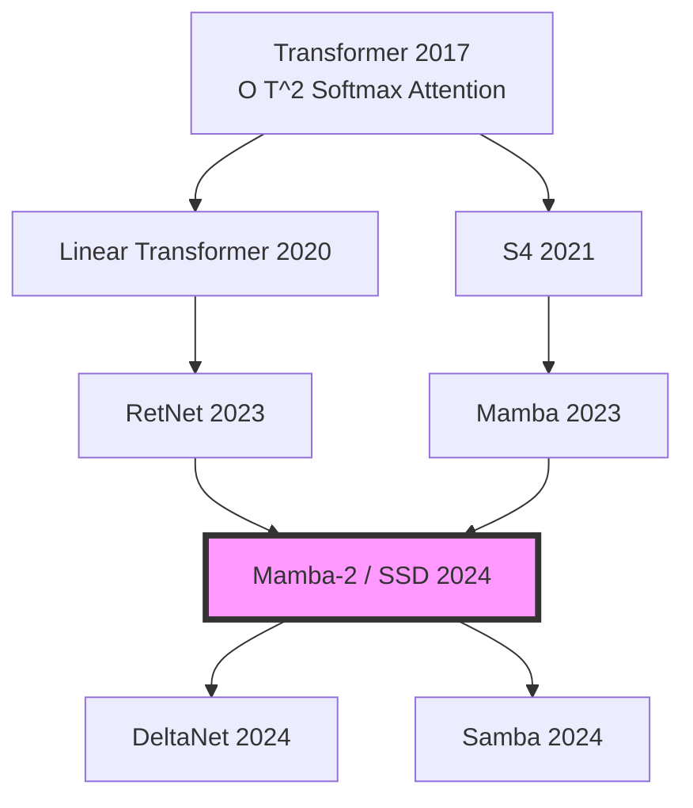

# Linear Attention: A Simple Introduction

I’ve recently been spending some time exploring the world of Linear Attention, and found it truely facinating. If you’ve been following the latest efficiency literature, you’ve likely seen models like Mamba and Gated DeltaNet shaking up the Transformer-dominant status quo.

In this series of posts, I’ll break down how these pieces fit together, the elegant math that makes linear scaling possible, and some of the breakthrough research pushing this field forward.

This post is adapted from a recent technical presentation I gave at [Myrtle.ai](https://myrtle.ai) on Linear Attention and State-Space Models (SSMs).

<a href="files/slides/linear_attention_1.pdf" target="_blank" class="resource-card">
    
<i class="fas fa-file-pdf"></i>

    

        <h4 class="resource-title">Presentation Slides: Linear Attention & Mamba</h4>
        
Presented at Myrtle.ai (March 2026). An overview of state-space duality and the evolution of linear attention.

    

</a>

## Recap: Softmax Attention

We all love Softmax Attention, but it has the notorious $\mathcal{O}(T^2)$ scaling problem. Let's figure out why this is the case from the first principles:

$$V^{\prime} = \text{softmax} \left( \frac{QK^T}{\sqrt{D}} \right) V \tag{1}$$

Here $Q, K, V \in \mathbb{R}^{T \times D}$, where $T$ is the time dimension (sequence length), and $D$ represents the size of the hidden states.

> **Reminder: Matrix Multiplication Complexity**
> For $A \in \mathbb{R}^{M \times N}$ and $B \in \mathbb{R}^{N \times P}$, the time complexity to compute $A B$ is **$O(M \cdot N \cdot P)$**.

By tracking the shape changes during the computation, the quadratic complexity becomes clear:

| Operation | Shape Change | Complexity |
| :--- | :--- | :--- |
| $QK^T$ | $(T, D) \times (D, T) \to (T, T)$ | **$O(T^2 D)$** |
| $\text{softmax}(\cdot)$ | $(T, T) \to (T, T)$ | $O(T^2)$ |
| $(\cdot)V$ | $(T, T) \times (T, D) \to (T, D)$ | **$O(T^2 D)$** |

This $T^2$ scaling makes long-context processing extremely expensive. Furthermore, Softmax is **non-associative**, meaning we cannot swap the order of matrix multiplication: $$\text{softmax}(QK^T)V \neq Q(K^T V) \tag{2}$$.

## What if? Restoring Associativity

**The hypothesis:** If we can decompose $\text{softmax}(QK^T)$ into $\Phi(Q)\Phi(K)^T$, for $\Phi(Q) \in \mathbb{R}^{T \times D^{\prime}}$, we can leverage the **associative property** of matrix multiplication.

$$V^{\prime} = \underbrace{\Phi(Q)}\_{\in \mathbb{R}^{T \times D^{\prime}}} \left( \underbrace{\Phi(K)^T}\_{\in \mathbb{R}^{D^{\prime} \times T}} \underbrace{V}\_{\in \mathbb{R}^{T \times D}} \right) \tag{3}$$

Similarly, let's check out new training complexity by inspecting the shape changes:

| Operation | Shape Change | Complexity |
| :--- | :--- | :--- |
| $\Phi(K)^T V$ | $(D', T) \times (T, D) \to (D', D)$ | $O(T D D')$ |
| $\Phi(Q) (\cdot)$ | $(T, D') \times (D', D) \to (T, D)$ | $O(T D D')$ |

Hooray, it's linear! But you might ask, how can we find the $\Phi(\cdot)$?

## Let's Derive Linear Attention

To see how we get to the linear version, let's look at the calculation for the $i$-th row of the output matrix $V'$. Since the $i$-th row of the Softmax only depends on the $i$-th query $Q\_i$, we can write:

$$V'\_i = \text{softmax} \left( \frac{Q\_i K^\top}{\sqrt{D}} \right) V \tag{4}$$

> **Softmax Reminder**: For a row vector $\mathbf{x} \in \mathbb{R}^{1 \times T}$, the $j$-th element is $\text{softmax}(\mathbf{x})\_j = \frac{\exp(x\_j)}{\sum\_k \exp(x\_k)}$. 

Expanding Equation (4), we can visualize the $i$-th row $V'\_i$ as the product of a row vector of softmax weights and a "column" of row vectors $\{V\_1, \dots, V\_T\}$:

$$V'\_i = \begin{bmatrix} \text{softmax}(\frac{Q\_i K^\top}{\sqrt{D}})\_1 & \dots & \text{softmax}(\frac{Q\_i K^\top}{\sqrt{D}})\_T \end{bmatrix} \begin{bmatrix} V\_1 \\ \vdots \\ V\_T \end{bmatrix} \tag{5}$$

By substituting the full definition of the softmax into each term, we get:

$$V'\_i = \footnotesize \begin{bmatrix} \frac{\exp(Q\_i K\_1^\top / \sqrt{D})}{\sum\_k \exp(Q\_i K\_k^\top / \sqrt{D})} & \dots & \frac{\exp(Q\_i K\_T^\top / \sqrt{D})}{\sum\_k \exp(Q\_i K\_k^\top / \sqrt{D})} \end{bmatrix} \begin{bmatrix} V\_1 \\ \vdots \\ V\_T \end{bmatrix} \tag{6}$$

Calculating this dot product results in the classic weighted sum of all rows $V\_j$:

$$V\_i^{\prime} = \sum\_{j=1}^T \frac{\exp(Q\_i K\_j^\top / \sqrt{D})}{\sum\_{k=1}^T \exp(Q\_i K\_k^\top / \sqrt{D})} V\_j \tag{7}$$

We can make this more general by defining a similarity function (also known as *"kernel"* ) $\operatorname{sim}(Q\_i, K\_j) = \exp(Q\_i K\_j^\top / \sqrt{D})$. If we pull the denominator out of the sum, we get:

$$V\_i^{\prime} = \frac{\sum\_{j=1}^T \operatorname{sim}(Q\_i, K\_j) V\_j}{\sum\_{k=1}^T \operatorname{sim}(Q\_i, K\_k)} \tag{8}$$

This is the standard form. Now, the magic happens when we find a feature map $\phi(\cdot)$ such that $\operatorname{sim}(Q\_i, K\_j) = \phi(Q\_i) \phi(K\_j)^\top$:

$$V'\_i = \frac{\phi(Q\_i) \left( \sum\_{j=1}^{T} \phi(K\_j)^\top V\_j \right)}{\phi(Q\_i) \left( \sum\_{j=1}^{T} \phi(K\_j)^\top \right)} \tag{9}$$

### Training Complexity: Detailed Breakdown

| Operation | Shape Change | Complexity |
| :--- | :--- | :--- |
| **Numerator: $\Phi(Q) (\Phi(K)^\top V)$** | | |
| $\Phi(K)^\top V$ | $(D', T) \times (T, D) \to (D', D)$ | $O(T D D')$ |
| $\Phi(Q) (\cdot)$ | $(T, D') \times (D', D) \to (T, D)$ | $O(T D D')$ |
| **Denominator: $\Phi(Q) (\Phi(K)^\top \mathbf{1})$** | | |
| $\Phi(K)^\top \mathbf{1}$ | $(D', T) \times (T, 1) \to (D', 1)$ | $O(T D')$ |
| $\Phi(Q) (\cdot)$ | $(T, D') \times (D', 1) \to (T, 1)$ | $O(T D')$ |
| **Normalization** | | |
| Row-wise Division | $(T, D) \text{ by } (T, 1)$ | $O(T D)$ |

## Deriving the Feature Map $\phi(x)$

### 1st Order Approximation
Consider the first-order Taylor expansion of the exponential:
$$\exp(Q\_i K\_j^\top) \approx 1 + Q\_i K\_j^\top \tag{10}$$

Defining $\phi(x) = \begin{bmatrix} 1 & x \end{bmatrix}$ recovers this, since:
$$\phi(Q\_i)\phi(K\_j)^\top = \begin{bmatrix} 1 & Q\_i \end{bmatrix} \begin{bmatrix} 1 \\ K\_j^\top \end{bmatrix} = 1 + Q\_i K\_j^\top \tag{11}$$

### Full Exponential Kernel
$$\exp(Q\_i K\_j^\top) = \sum\_{n=0}^{\infty} \frac{(Q\_i K\_j^\top)^n}{n!} \tag{12}$$

Which implies an infinite feature map:
$$\phi(x) = \left[ 1, x, \frac{x^{\otimes 2}}{\sqrt{2!}}, \dots, \frac{x^{\otimes n}}{\sqrt{n!}}, \dots \right] \tag{13}$$

### What $\phi(\cdot)$ is used in literature?
Any feature map $\phi: \mathbb{R}^D \to \mathbb{R}^{D'}$ works if it satisfies $\phi(x) \geq 0$ (element-wise) for numerical stability.

| Model | Feature Map $\phi(x)$ | Goal |
| :--- | :--- | :--- |
| **Linear Transformer** | $\text{elu}(x) + 1$ | Efficiency/Simplicity |
| **Performer** | Random Fourier Features | Softmax Approx. |
| **Mamba-2 (SSD)** | Implicit (State Expansion) | - |

## Make Inference Like an RNN

Causal linear attention layers can be viewed as RNNs where $S\_i$ and $Z\_i$ act as internal hidden states (memory).

**State Updates:**
$$s\_i = s\_{i-1} + \phi(x\_i W\_K) (x\_i W\_V)^T \tag{14}$$
$$z\_i = z\_{i-1} + \phi(x\_i W\_K) \tag{15}$$

**Output Prediction:**
$$y\_i = f\_l \left( \frac{\phi(x\_i W\_Q)^T s\_i}{\phi(x\_i W\_Q)^T z\_i} + x\_i \right) \tag{16}$$

### Complexity Summary
*   **Training complexity:** $O(T)$
*   **Inference complexity:** $O(1)$
    1. Update KV State: $S_{new} = S_{old} + k_{new}^T v_{new}$ ($O(D^2)$)
    2. Update Normalizer: $z_{new} = z_{old} + k_{new}$ ($O(D)$)
    3. Compute Output: $y_{new} = f_l \left( \frac{q_{new} S_{new}}{q_{new} z_{new}^T} + x_{new} \right)$ ($O(D^2)$)

## The Evolution of Linear Models

## Wrapping Up

Linear Attention isn't just a "faster version" of attention; it’s a fundamental shift toward maintaining a compressed, evolving state.

**What we didn't cover today:**
* Hardware (GPU) efficient algorithms (e.g., block-matrix decomposition).
* Specific model architectures.

**Next Up: State Space Models (Mamba)**

Check out the code: 👉 [linear-attention-demo](https://github.com/MatthewZhang473/linear-attention-demo)
