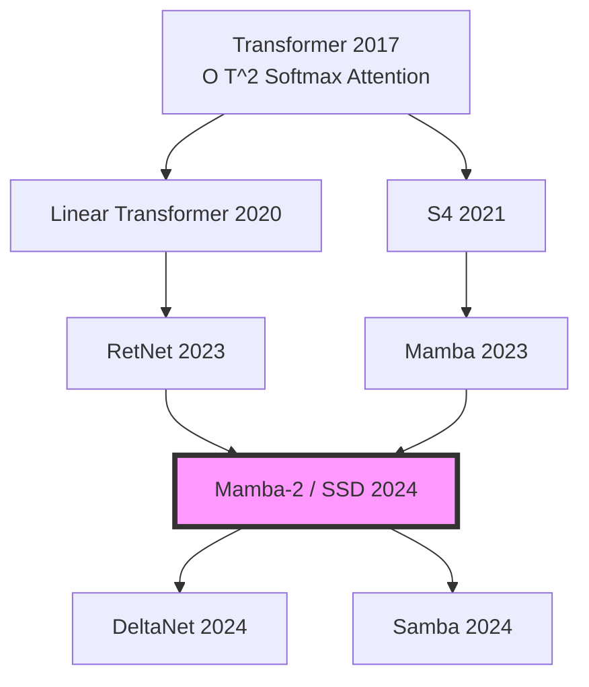

# Linear Attention: A Simple Introduction

I recently read the Mamba2 paper and is facinated by the idea of state-space duality: how linear attentions relates to a state-space model like Mamba. I recently gave a presentation at [Myrtle.ai](https://myrtle.ai) about this topic, and this post summarizes the evolution of Linear Attention and its fascinating relationship with State-Space Models (SSMs).

<a href="files/slides/linear_attention_1.pdf" target="_blank" class="resource-card">
    
<i class="fas fa-file-pdf"></i>

    

        <h4 class="resource-title">Presentation Slides: Linear Attention & Mamba</h4>
        
Presented at Myrtle.ai (March 2026). An overview of state-space duality and the evolution of linear attention.

    

</a>

## Why we're stuck at $O(T^2)$

Standard Softmax Attention has a massive scaling problem:

$$V^{\prime} = \text{softmax} \left( \frac{QK^T}{\sqrt{D}} \right) V$$

**Reminder: Matrix Multiplication Complexity**
For $A \in \mathbb{R}^{M \times N}$ and $B \in \mathbb{R}^{N \times P}$, the complexity is **$O(M \cdot N \cdot P)$**.

| Operation | Shape Change | Complexity |
| :--- | :--- | :--- |
| $QK^T$ | $(T, D) \times (D, T) \to (T, T)$ | **$O(T^2 D)$** |
| $\text{softmax}(\cdot)$ | $(T, T) \to (T, T)$ | $O(T^2)$ |
| $(\cdot)V$ | $(T, T) \times (T, D) \to (T, D)$ | **$O(T^2 D)$** |

This $T^2$ scaling makes long-context processing extremely expensive. Furthermore, Softmax is **non-associative**, meaning we cannot swap the order of matrix multiplication: $\text{softmax}(QK^T)V \neq Q(K^T V)$.

## What if? Restoring Associativity

**The hypothesis:** If we can decompose $\text{softmax}(QK^T)$ into $\Phi(Q)\Phi(K)^T$, for $\Phi(Q) \in \mathbb{R}^{T \times D^{\prime}}$, we can leverage the **associative property** of matrix multiplication.

$$V^{\prime} = \underbrace{\Phi(Q)}\_{\in \mathbb{R}^{T \times D^{\prime}}} \left( \underbrace{\Phi(K)^T}\_{\in \mathbb{R}^{D^{\prime} \times T}} \underbrace{V}\_{\in \mathbb{R}^{T \times D}} \right)$$

Check out the new training complexity:

| Operation | Shape Change | Complexity |
| :--- | :--- | :--- |
| $\Phi(K)^T V$ | $(D', T) \times (T, D) \to (D', D)$ | $O(T D D')$ |
| $\Phi(Q) (\cdot)$ | $(T, D') \times (D', D) \to (T, D)$ | $O(T D D')$ |

## Let's Derive Linear Attention

Consider the $i$-th query and unpack the softmax:

$$V\_i^{\prime} = \frac{\sum\_{j=1}^T \operatorname{sim}(Q\_i, K\_j) V\_j}{\sum\_{j=1}^T \operatorname{sim}(Q\_i, K\_j)}$$

If we find a feature map $\phi(\cdot)$ such that $\operatorname{sim}(Q\_i, K\_j) = \phi(Q\_i) \phi(K\_j)^\top$:

$$V'\_i = \frac{\phi(Q\_i) \left( \sum\_{j=1}^{T} \phi(K\_j)^\top V\_j \right)}{\phi(Q\_i) \left( \sum\_{j=1}^{T} \phi(K\_j)^\top \right)}$$

### Training Complexity: Detailed Breakdown

| Operation | Shape Change | Complexity |
| :--- | :--- | :--- |
| **Numerator: $\Phi(Q) (\Phi(K)^\top V)$** | | |
| $\Phi(K)^\top V$ | $(D', T) \times (T, D) \to (D', D)$ | $O(T D D')$ |
| $\Phi(Q) (\cdot)$ | $(T, D') \times (D', D) \to (T, D)$ | $O(T D D')$ |
| **Denominator: $\Phi(Q) (\Phi(K)^\top \mathbf{1})$** | | |
| $\Phi(K)^\top \mathbf{1}$ | $(D', T) \times (T, 1) \to (D', 1)$ | $O(T D')$ |
| $\Phi(Q) (\cdot)$ | $(T, D') \times (D', 1) \to (T, 1)$ | $O(T D')$ |
| **Normalization** | | |
| Row-wise Division | $(T, D) \text{ by } (T, 1)$ | $O(T D)$ |

## Deriving the Feature Map $\phi(x)$

### 1st Order Approximation
$\exp(Q\_i K\_j^\top) \approx 1 + Q\_i K\_j^\top$. Defining $\phi(x) = \begin{bmatrix} 1 & x \end{bmatrix}$ recovers this.

### Full Exponential Kernel
$$\exp(Q\_i K\_j^\top) = \sum\_{n=0}^{\infty} \frac{(Q\_i K\_j^\top)^n}{n!} \implies \phi(x) = \left[ 1, x, \frac{x^{\otimes 2}}{\sqrt{2!}}, \dots, \frac{x^{\otimes n}}{\sqrt{n!}}, \dots \right]$$

### What $\phi(\cdot)$ is used in literature?
Any feature map $\phi: \mathbb{R}^D \to \mathbb{R}^{D'}$ works if it satisfies $\phi(x) \geq 0$ (element-wise) for numerical stability.

| Model | Feature Map $\phi(x)$ | Goal |
| :--- | :--- | :--- |
| **Linear Transformer** | $\text{elu}(x) + 1$ | Efficiency/Simplicity |
| **Performer** | Random Fourier Features | Softmax Approx. |
| **Mamba-2 (SSD)** | Implicit (State Expansion) | - |

## Make Inference Like an RNN

Causal linear attention layers can be viewed as RNNs where $S\_i$ and $Z\_i$ act as internal hidden states (memory).

**State Updates:**
$$s\_i = s\_{i-1} + \phi(x\_i W\_K) (x\_i W\_V)^T, \quad z\_i = z\_{i-1} + \phi(x\_i W\_K)$$

**Output Prediction:**
$$y\_i = f\_l \left( \frac{\phi(x\_i W\_Q)^T s\_i}{\phi(x\_i W\_Q)^T z\_i} + x\_i \right)$$

### Complexity Summary
*   **Training complexity:** $O(T)$
*   **Inference complexity:** $O(1)$
    1. Update KV State: $S_{new} = S_{old} + k_{new}^T v_{new}$ ($O(D^2)$)
    2. Update Normalizer: $z_{new} = z_{old} + k_{new}$ ($O(D)$)
    3. Compute Output: $y_{new} = f_l \left( \frac{q_{new} S_{new}}{q_{new} z_{new}^T} + x_{new} \right)$ ($O(D^2)$)

## The Evolution of Linear Models

## Wrapping Up

Linear Attention isn't just a "faster version" of attention; it’s a fundamental shift toward maintaining a compressed, evolving state.

**What we didn't cover today:**
* Hardware (GPU) efficient algorithms (e.g., block-matrix decomposition).
* Specific model architectures.

**Next Up: State Space Models (Mamba)**

Check out the code: 👉 [linear-attention-demo](https://github.com/MatthewZhang473/linear-attention-demo)
