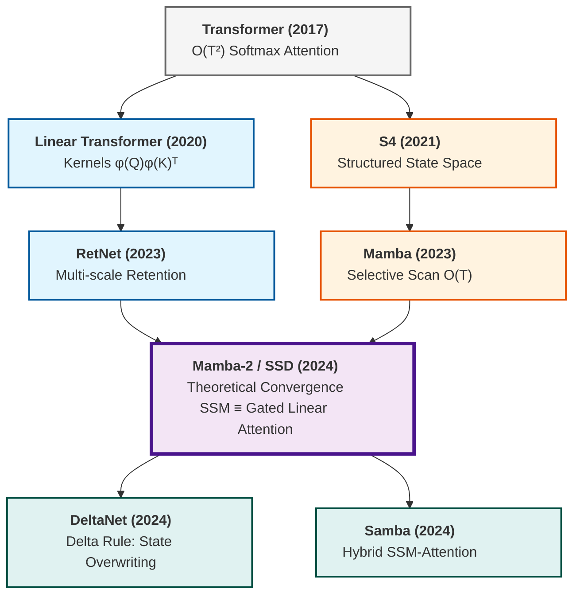

# Understand Linear Attention from Scratch (Part I)

I’ve recently been spending some time exploring the world of Linear Attention, and found it truly fascinating. If you’ve been following the latest efficiency literature, you’ve likely seen models like "Mamba" and "Gated DeltaNet" shaking up the Transformer-dominant status quo.

In this series of posts, my goal is to move past the high-level buzzwords and re-derive the mechanics from first principles. I’ve intentionally focused on the math here—I find that walking through the derivation step-by-step is a great way to understand how we can transform a quadratic bottleneck into a linear solution. I hope you find the deep dive just as rewarding as I did.

This post is adapted from a recent technical presentation I gave at [Myrtle.ai](https://myrtle.ai) on Linear Attention and State-Space Models (SSMs).

<a href="files/slides/linear_attention_1.pdf" target="_blank" class="resource-card">
    
<i class="fas fa-file-pdf"></i>

    

        <h4 class="resource-title">Presentation Slides: Linear Attention & Mamba</h4>
        
Presented at Myrtle.ai (March 2026). An overview of state-space duality and the evolution of linear attention.

    

</a>

## Recap: Softmax Attention

We all love Softmax Attention, but it has the notorious $\mathcal{O}(T^2)$ scaling problem. Let's figure out why this is the case from the first principles:

$$V^{\prime} = \text{softmax} \left( \frac{QK^T}{\sqrt{D}} \right) V \tag{1}$$

Here $Q, K, V \in \mathbb{R}^{T \times D}$, where $T$ is the time dimension (sequence length), and $D$ represents the size of the hidden states.

> **Reminder: Matrix Multiplication Complexity**
> For $A \in \mathbb{R}^{M \times N}$ and $B \in \mathbb{R}^{N \times P}$, the time complexity to compute $A B$ is **$O(M \cdot N \cdot P)$**.

By tracking the shape changes during the computation, the quadratic complexity becomes clear:

| Operation | Shape Change | Complexity |
| :--- | :--- | :--- |
| $QK^T$ | $(T, D) \times (D, T) \to (T, T)$ | **$O(T^2 D)$** |
| $\text{softmax}(\cdot)$ | $(T, T) \to (T, T)$ | $O(T^2)$ |
| $(\cdot)V$ | $(T, T) \times (T, D) \to (T, D)$ | **$O(T^2 D)$** |

This $T^2$ scaling makes long-context processing extremely expensive. Furthermore, Softmax is **non-associative**, meaning we cannot swap the order of matrix multiplication: $$\text{softmax}(QK^T)V \neq Q(K^T V) \tag{2}$$

## What if? Restoring Associativity

**The hypothesis:** If we can decompose $\text{softmax}(QK^T)$ into $\Phi(Q)\Phi(K)^T$, for $\Phi(Q) \in \mathbb{R}^{T \times D^{\prime}}$, we can leverage the **associative property** of matrix multiplication.

$$V^{\prime} = \underbrace{\Phi(Q)}\_{\in \mathbb{R}^{T \times D^{\prime}}} \left( \underbrace{\Phi(K)^T}\_{\in \mathbb{R}^{D^{\prime} \times T}} \underbrace{V}\_{\in \mathbb{R}^{T \times D}} \right) \tag{3}$$

Similarly, let's check out new training complexity by inspecting the shape changes:

| Operation | Shape Change | Complexity |
| :--- | :--- | :--- |
| $\Phi(K)^T V$ | $(D', T) \times (T, D) \to (D', D)$ | $O(T D D')$ |
| $\Phi(Q) (\cdot)$ | $(T, D') \times (D', D) \to (T, D)$ | $O(T D D')$ |

Hooray!  We've achieved linear complexity - but it still feels a bit like magic. To really get comfortable with this, we need to answer two practical questions:

1. **How** does the softmax decomposition work?
2. **What** exactly is $\Phi$?

Let's walk through the derivation and see if we can make it all click.

## Let's Derive Linear Attention from First Principles

To see how softmax is decomposed in the linear version paradigm, let's begin by looking at the $i$-th row of the Softmax in Equation (1), which only depends on the $i$-th query $Q\_i$:

$$V'\_i = \text{softmax} \left( \frac{Q\_i K^\top}{\sqrt{D}} \right) V \tag{4}$$

By expanding Equation (4), we can visualize it as a weighted combination of all values. Specifically, it is the dot product between the sequence of attention scores for query $Q_i$ and the corresponding value vectors:

$$V'\_i = \begin{bmatrix} \text{softmax}\left(\frac{Q\_i K^\top}{\sqrt{D}}\right)\_1 & \dots & \text{softmax}\left(\frac{Q\_i K^\top}{\sqrt{D}}\right)\_T \end{bmatrix} \begin{bmatrix} V\_1 \\\\ \vdots \\\\ V\_T \end{bmatrix} \tag{5}$$

> **Softmax Reminder**: For a row vector $\mathbf{x} \in \mathbb{R}^{1 \times T}$, the $j$-th element is $\text{softmax}(\mathbf{x})\_j = \frac{\exp(x\_j)}{\sum\_k \exp(x\_k)}$. 

By substituting the full definition of the softmax into each term, we get:

$$V'\_i = \footnotesize \begin{bmatrix} \frac{\exp(Q\_i K\_1^\top / \sqrt{D})}{\sum\_k \exp(Q\_i K\_k^\top / \sqrt{D})} & \dots & \frac{\exp(Q\_i K\_T^\top / \sqrt{D})}{\sum\_k \exp(Q\_i K\_k^\top / \sqrt{D})} \end{bmatrix} \begin{bmatrix} V\_1 \\\\ \vdots \\\\ V\_T \end{bmatrix} \tag{6}$$

Calculating this dot product results in the classic weighted sum of all rows $V\_j$:

$$V\_i^{\prime} = \sum\_{j=1}^T \frac{\exp(Q\_i K\_j^\top / \sqrt{D})}{\sum\_{k=1}^T \exp(Q\_i K\_k^\top / \sqrt{D})} V\_j = \frac{\sum\_{j=1}^T \exp(Q\_i K\_j^\top / \sqrt{D}) V\_j}{\sum\_{k=1}^T \exp(Q\_i K\_k^\top / \sqrt{D})} \tag{7}$$

We can make this more general by defining a similarity function (also known as *"kernel"* ) $\operatorname{sim}(Q\_i, K\_j) = \exp(Q\_i K\_j^\top / \sqrt{D})$. This simplifies Equation 6 to:

$$V\_i^{\prime} = \frac{\sum\_{j=1}^T \operatorname{sim}(Q\_i, K\_j) V\_j}{\sum\_{k=1}^T \operatorname{sim}(Q\_i, K\_k)} \tag{8}$$

This is the standard form. Now, the magic happens when we find a feature map $\phi(\cdot)$ such that $\operatorname{sim}(Q\_i, K\_j) = \phi(Q\_i) \phi(K\_j)^\top$ (we will see what $\phi(\cdot)$ is in a moment):

$$V'\_i = \frac{\sum\_{j=1}^T (\textcolor{#3498db}{\phi(Q\_i)} \phi(K\_j)^\top) V\_j}{\sum\_{k=1}^T \textcolor{#3498db}{\phi(Q\_i)} \phi(K\_k)^\top} = \frac{\textcolor{#3498db}{\phi(Q\_i)} \left( \sum\_{j=1}^{T} \phi(K\_j)^\top V\_j \right)}{\textcolor{#3498db}{\phi(Q\_i)} \left( \sum\_{k=1}^{T} \phi(K\_k)^\top \right)} \tag{9}$$

By re-arranging the terms, we have successfully decoupled $Q$ and $K$! 

To process the entire sequence at once, we "stack" our feature-mapped vectors into matrices $\Phi(Q), \Phi(K) \in \mathbb{R}^{T \times D'}$, and define $\mathbf{1}_T \in \mathbb{R}^{T \times 1} $ as a column vector of ones:

$$\Phi(Q) = \begin{bmatrix} \phi(Q_1)^\top \\\\ \vdots \\\\ \phi(Q_T)^\top \end{bmatrix}, \quad \Phi(K) = \begin{bmatrix} \phi(K_1)^\top \\\\ \vdots \\\\ \phi(K_T)^\top \end{bmatrix}, \quad \mathbf{1}_T = \begin{bmatrix} 1 \\\\ \vdots \\\\ 1 \end{bmatrix}$$
The full linearized attention for the entire sequence becomes:

$$V' = \frac{\Phi(Q) \left( \Phi(K)^\top V \right)}{\Phi(Q) \left( \Phi(K)^\top \mathbf{1}_T \right)} \tag{10}$$

> Note: The division is performed row-wise, broadcasting the denominator.

Crucially, this parallel form in Equation 10 (and its gradients) can be computed across the entire sequence at once, providing the same high-throughput training as a standard Transformer.

### Training Complexity: Detailed Breakdown

Finally, we can eyeball the time complexities by tracing all the operations in Equation 10:

| Operation | Shape Change | Complexity |
| :--- | :--- | :--- |
| **Numerator: $\Phi(Q) (\Phi(K)^\top V)$** | | |
| $\Phi(K)^\top V$ | $(D', T) \times (T, D) \to (D', D)$ | $O(T D D')$ |
| $\Phi(Q) (\cdot)$ | $(T, D') \times (D', D) \to (T, D)$ | $O(T D D')$ |
| **Denominator: $\Phi(Q) (\Phi(K)^\top \mathbf{1})$** | | |
| $\Phi(K)^\top \mathbf{1}$ | $(D', T) \times (T, 1) \to (D', 1)$ | $O(T D')$ |
| $\Phi(Q) (\cdot)$ | $(T, D') \times (D', 1) \to (T, 1)$ | $O(T D')$ |
| **Normalization** | | |
| Row-wise Division | $(T, D) \text{ by } (T, 1)$ | $O(T D)$ |

$\mathcal{O}(T)$ complexity, just as expected! 

## Deriving the Feature Map $\phi(\cdot)$

Now that we’ve established the $\mathcal{O}(T)$ complexity, let’s tackle our second question: can we find a $\phi(\cdot)$ such that $\operatorname{sim}(Q_i, K_j) = \phi(Q_i) \phi(K_j)^\top$?

Let's start with the exponential kernel $\operatorname{sim}(Q_i, K_j) = \exp(Q_i K_j^\top)$ used in softmax attention (dropping the $\sqrt{D}$ for simplicity).

### 1st Order Approximation
Consider the first-order Taylor expansion of the exponential:
$$\exp(Q\_i K\_j^\top) \approx 1 + Q\_i K\_j^\top \tag{11}$$

Defining a simple feature map $\phi(x) = \begin{bmatrix} 1 & x \end{bmatrix}$ recovers this, since:
$$\phi(Q\_i)\phi(K\_j)^\top = \begin{bmatrix} 1 & Q\_i \end{bmatrix} \begin{bmatrix} 1 \\\\ K\_j^\top \end{bmatrix} = 1 + Q\_i K\_j^\top \tag{12}$$

### Full Exponential Kernel

For the full exponential kernel:
$$\exp(Q\_i K\_j^\top) = \sum\_{n=0}^{\infty} \frac{(Q\_i K\_j^\top)^n}{n!} \tag{13}$$

The decomposition isn't as obvious. In fact, it requires an infinite feature map (i.e., $D^\prime = \infty$):
$$\phi(x) = \left[ 1, x, \frac{x^{\otimes 2}}{\sqrt{2!}}, \dots, \frac{x^{\otimes n}}{\sqrt{n!}}, \dots \right] \tag{14}$$

### What $\phi(\cdot)$ is used in literature?

This shows that finding a tractable decomposition for the exact exponential kernel is difficult. Instead, researchers typically take one of two paths:
1. **Approximate** the softmax kernel with a finite feature map (as seen in the Performer paper).
2. **Move beyond** the exact softmax kernel and use a different similarity function that decomposes into a finite-dimensional $\phi(\cdot)$.

In practice, any feature map $\phi: \mathbb{R}^D \to \mathbb{R}^{D'}$ defines a valid kernel if $\phi(x) \geq 0$ (element-wise) for numerical stability. I personally see it as a trade-off: we sacrifice some properties of the exponential kernel for much better computational guarantees.

The following are common feature maps used in well-known models; they perform almost as well as standard softmax attention:

| Model | Feature Map $\phi(x)$ | Goal |
| :--- | :--- | :--- |
| **Linear Transformer** | $\text{elu}(x) + 1$ | Efficiency/Simplicity |
| **Performer** | Random Fourier Features | Softmax Approx. |
| **Mamba-2 (SSD)** | Implicit (State Expansion) | - |

## Beyond Training: The Recurrent View (Inference)

While the parallel form is great for training, the real power of Linear Attention lies in its **recurrent interpretation** for inference. In autoregressive models, a token at position $i$ can only attend to previous tokens $j \leq i$.

### Causal Masking

To implement this constraint in the linear framework, we modify Equation (10) to only include tokens up to the current position $i$. The only change is the upper bound of the summation: instead of summing over the entire sequence ($j = 1 \dots T$), we now only sum up to the current step ($j = 1 \dots i$).

$$V'\_i = \frac{\phi(Q\_i) \left( \sum\_{j=1}^i \phi(K\_j)^\top V\_j \right)}{\phi(Q\_i) \left( \sum\_{j=1}^i \phi(K\_j)^\top \right)} \tag{15}$$

By defining the cumulative states $S\_i$ and $Z\_i$ as our "memory":

$$S\_i = \sum\_{j=1}^i \phi(K\_j)^\top V\_j, \quad Z\_i = \sum\_{j=1}^i \phi(K\_j)^\top \tag{16}$$

The output at step $i$ becomes:

$$V'\_i = \frac{\phi(Q\_i) S\_i}{\phi(Q\_i) Z\_i} \tag{17}$$

### The RNN Formulation

Notice that $S\_i$ and $Z\_i$ can be updated incrementally from the previous step in $\mathcal{O}(1)$ time relative to the sequence length. This transforms the attention mechanism into a linear RNN:

**Step 1: Update State (Memory)**
$$s\_i = s\_{i-1} + \phi(k\_i)^\top v\_i \tag{18}$$
$$z\_i = z\_{i-1} + \phi(k\_i)^\top \tag{19}$$

**Step 2: Generate Output**
$$y\_i = f\_l \left( \frac{\phi(q\_i) s\_i}{\phi(q\_i) z\_i} \right) + x\_i \tag{20}$$

Where:
*   **$s\_i$**: The attention memory (storing feature-value interactions).
*   **$z\_i$**: The normalizer memory (tracking cumulative feature magnitudes).
*   **$f\_l$**: The output projection (e.g., Feed-Forward or Norm).
*   **$x\_i$**: The residual connection.

This explains why modern models like Mamba are often viewed as "Linear RNNs"—they maintain a fixed-size state that summarizes the entire past, rather than re-scanning an ever-growing KV cache.

## Summary

Linear Attention shifts the paradigm from a global memory bottleneck to a streamlined, recurrent process. By replacing the Softmax kernel with a decomposable feature map, we achieve:

 - Linear Training Complexity: Scaling becomes $\mathcal{O}(T)$ instead of quadratic. Doubling the sequence length only doubles the compute, rather than quadrupling it.

- Constant-Time Inference: During generation, the model behaves as a Linear RNN with a fixed-size state, eliminating the need for an ever-growing KV cache.

The Recurrent Update ($\mathcal{O}(1)$ per step)
1. Update State: $s_i = s_{i-1} + \phi(k_i)^\top v_i$
2. Update Normalizer: $z_i = z_{i-1} + \phi(k_i)^\top$
3. Generate Output: $y_i = f_l \left( \frac{\phi(q_i) s_i}{\phi(q_i) z_i} \right) + x_i$

This provides the best of both worlds: the parallelizable training of Transformers and the constant-memory inference of RNNs.

## The Evolution of Linear Attention Models:

The landscape of efficient sequence modeling has shifted from trying to "fix" Softmax to reimagining the entire mechanism. The (highly simplified) diagram below traces the lineage of these methods—from the early $\mathcal{O}(T^2)$ Transformers to the modern "State-Space Duality" (SSD) era.

Note the convergence: what began as two separate disciplines—Linear Attention (scaling the kernel) and State-Space Models (scaling the recurrence)—eventually unified in Mamba-2. This theoretical bridge proved that these two approaches are mathematically two sides of the same coin.

In the upcoming posts, we will dive into more interesting linear architectures in detail.

## Wrapping Up

Linear Attention represents more than just a "faster" Transformer; it is a fundamental shift toward maintaining a compressed, evolving state. By trading the exact Softmax kernel for a decomposable feature map, we gain the ability to process long contexts with constant memory.

This post laid the mathematical foundation, but the story doesn't end here. In the next part of this series, we will dive into State-Space Models (SSMs) and explore how Mamba leverages hardware-aware algorithms to turn this theoretical efficiency into real-world performance.

### Ready to see it in action?
If you find that code makes the math "click," check out the demo repository. I’ve implemented these models using Flash-Linear-Attention library so you can compare architectures like *Mamba-2* and *Gated DeltaNet* against a standard Llama-style Transformer using the TinyStories dataset.

👉 [**linear-attention-demo**](https://github.com/MatthewZhang473/linear-attention-demo)
